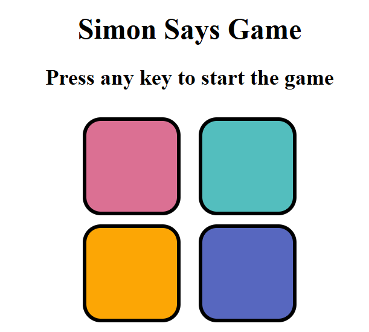

# Simon-Says-Game
A mini game based on the Simon Says game using HTML, CSS, and JavaScript.

# Simon Says Game
This is a digital version of the classic Simon Says memory game. The game challenges players to repeat an increasingly complex sequence of lights in the correct order. The objective is to test and improve memory and concentration skills.

# Results

# Features:
Simple Gameplay: The computer generates a random sequence of colors, and the player must replicate the sequence.

Increasing Difficulty: As the player progresses, the sequence gets longer and faster, adding a challenge to the game.

Sound & Visual Effects: The game uses bright colors cues to indicate the sequence.

Game Over State: If the player makes a mistake, the game ends and provides feedback with the option to restart.

# Technologies Used:
HTML – For the game structure.

CSS – For styling the interface and colors.

JavaScript – For game logic and interactions.

# How to Play:
The game will start by displaying a color or light.

The player must repeat the sequence by clicking on the corresponding colors in the right order.

As the game progresses, the sequence becomes longer and faster.

The game ends when the player makes a mistake, and they can choose to restart.